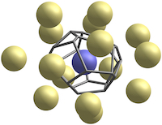

# VoroTop: Voronoi Cell Topology Visualization and Analysis Toolkit

## A powerful tool for visualizing and analyzing complex structure in particle systems



*VoroTop* is a software package designed to perform Voronoi topology analysis of spatial point sets in two and three dimensions, using a complete description of the Voronoi cell topology of each point. It is ideal for researchers and developers working with atomistic data sets, including those created through molecular dynamic simulation. *VoroTop* leverages the robust [`voro++`](https://github.com/chr1shr/voro) library to offer fast and accurate calculations, providing a flexible framework for extracting and analyzing Voronoi cell properties.


---

### Table of Contents

* [Features](#features)
* [Installation/Setup](#installationsetup)
    * [Prerequisites](#prerequisites)
    * [Compiling VoroTop](#compiling-vorotop)
* [Tutorial Through Examples](#tutorial)
* [Publications](#publications)
* [License](#license)
* [Contact/Support](#contactsupport)

---

### Features

* **Fast and accurate tessellation:** Quickly perform Voronoi cell topological analysis for large sets of particles using multicore CPUs.
* **Customizable analysis:** Extend VoroTop's functionality to perform specialized analyses relevant to your research.
* **Encapsulated post-script (EPS) images:** Create high-quality vector EPS images of two-dimensional systems.
* **Cross-platform compatibility:** Designed to compile and run on Linux, macOS, and Unix-like environments.

---

### Installation/Setup

This section guides you through setting up VoroTop on your system. Please read carefully, especially regarding the `voro++` dependency.

#### Prerequisites

VoroTop relies on the `voro++` library for its core Voronoi calculations. **It's critical that you install the `dev` branch of `voro++`**, as VoroTop utilizes features or fixes present only in that development version.

You'll also need a C++ compiler (like g++ or Clang) and the `make` utility.

**Steps to install `voro++` (dev branch):**

1.  **Ensure you have Git installed.** If not, follow instructions for your OS (e.g., `sudo apt-get install git` on Debian/Ubuntu, `brew install git` on macOS).
2.  **Clone the `voro++` repository and switch to the `dev` branch:**
    ```bash
    git clone -b dev https://github.com/chr1shr/voro.git
    ```
    This command will clone the `voro++` repository and automatically check out the `dev` branch.
3.  **Navigate into the `voro++` directory:**
    ```bash
    cd voro
    ```
4.  **Compile and install `voro++`:**
    ```bash
    make
    sudo make install
    ```
    * You may need to rename `config.mk.template` to `config.mk` before running `make`.
    * **Note for macOS:** If you encounter permission issues during `sudo make install`, you might need to adjust the install prefix or manually copy the headers and library files to appropriate system locations. Consult `voro++` documentation for advanced installation options.
    * **Note for Windows:** If you're on Windows, you'll need a Linux-like environment such as WSL (Windows Subsystem for Linux) or Cygwin/MinGW to compile `voro++` and VoroTop. The instructions above assume a Unix-like environment.

Once `voro++` (dev branch) is successfully installed, you can proceed with compiling VoroTop.

#### Compiling VoroTop

After installing `voro++` from the `dev` branch, follow these steps to compile VoroTop:

1.  **Clone the VoroTop repository:**
    ```bash
    git clone https://github.com/VoroTop/VoroTop.git 
    ```

2.  **Navigate into the VoroTop directory:**
    ```bash
    cd VoroTop
    ```

3.  **Build and install VoroTop:**

    ```bash
    make
    sudo make install
    ```
    This will compile the VoroTop executable and place it in a designated `bin/` folder.

    * **Troubleshooting:** If you encounter compilation errors related to `voro++` headers or libraries, ensure that `voro++` was installed correctly and its header files (`voro++/src/voro++.hh`) and library files are discoverable by your compiler. You might need to set `CPATH` or `LIBRARY_PATH` environment variables, or ensure `sudo make install` correctly placed them.

---

### Tutorial

Please see the included [VoroTop Tutorial Through Examples](TUTORIAL/README.md), in which we provide short hands-on lessons for learning how to use VoroTop. Through carefully designed examples, you will learn to perform various types of Voronoi topology analysis, starting from basic calculations to more advanced techniques.

---

### Publications

Further details, theoretical and practical, about Voronoi topology analysis of particle systems can be found in the following papers.

* Lazar, E.A. "*VoroTop: Voronoi Cell Topology Visualization and Analysis Toolkit*", [arXiv](https://arxiv.org/abs/1804.04221), [Model. Simul. Mater. Sci. Eng. 26:1](https://iopscience.iop.org/article/10.1088/1361-651X/aa9a01), 2017.

* Lazar, E.A., Lu, J., Rycroft, C.H., and Schwarcz, D., "*Characterizing structural features of two-dimensional particle systems through Voronoi topology*", [arXiv](https://arxiv.org/abs/2406.00553), [Model. Simul. Mater. Sci. Eng. 32:085022](https://iopscience.iop.org/article/10.1088/1361-651X/ad8ad9), 2024. 

* Lazar, E.A., Han, J. and Srolovitz, D.J. "*A Topological Framework for Local Structure Analysis in Condensed Matter*", [arXiv](https://arxiv.org/abs/1508.05937), [Proc. Natl. Acad. Sci. 112:E5769](https://www.pnas.org/doi/10.1073/pnas.1505788112), 2015.

* Worlitzer, V.M., Ariel, G., and Lazar, E.A., "*Pair correlation function based on Voronoi topology*", [arXiv](https://arxiv.org/abs/2210.09731), [Phys. Rev. E 108:064115](https://journals.aps.org/pre/abstract/10.1103/PhysRevE.108.064115), 2023. 

* Landweber, P.S., Lazar, E.A., Patel, N. "*On fiber diameters of continuous maps*", [arXiv](https://arxiv.org/abs/1503.07597), [Amer. Math. Monthly 123:4](https://www.jstor.org/stable/10.4169/amer.math.monthly.123.4.392), 2016.

* Lazar, E.A., Mason, J.K., MacPherson, R.D. and Srolovitz, D.J. "*Complete topology of cells, grains, and bubbles in three-dimensional microstructures*", [arXiv](https://arxiv.org/abs/1207.5054), [Phys. Rev. Lett. 109:095505](https://journals.aps.org/prl/abstract/10.1103/PhysRevLett.109.095505), 2012.

---

### License

Please see the included [licence notes](LICENSE).

---

### Contact/Support

Contributions are welcome!  Please be in touch with questions, comments, and suggestions, as well as about potential research collaborations.  Emails can be sent to "help" at-sign "vorotop" dot "org".


