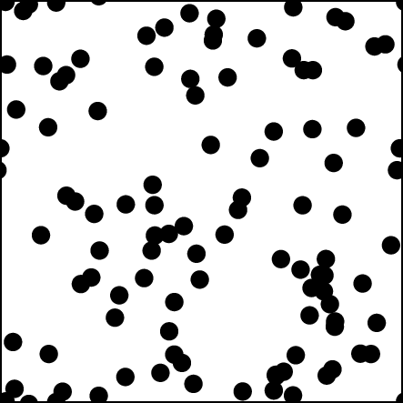
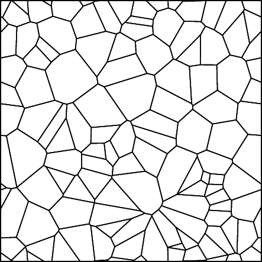
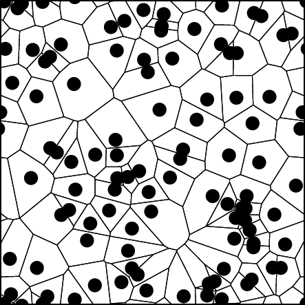
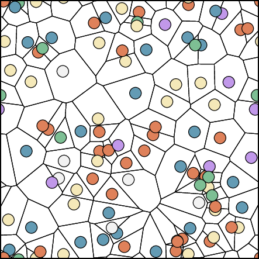
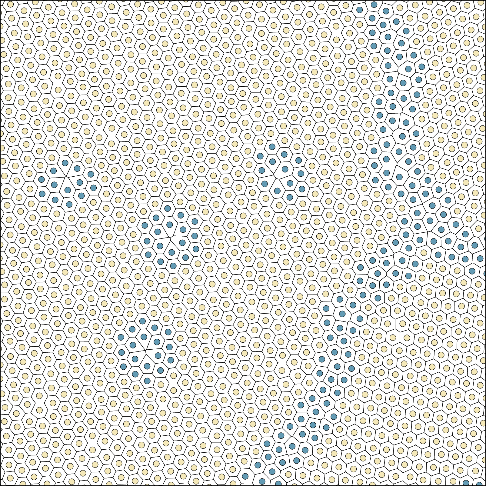
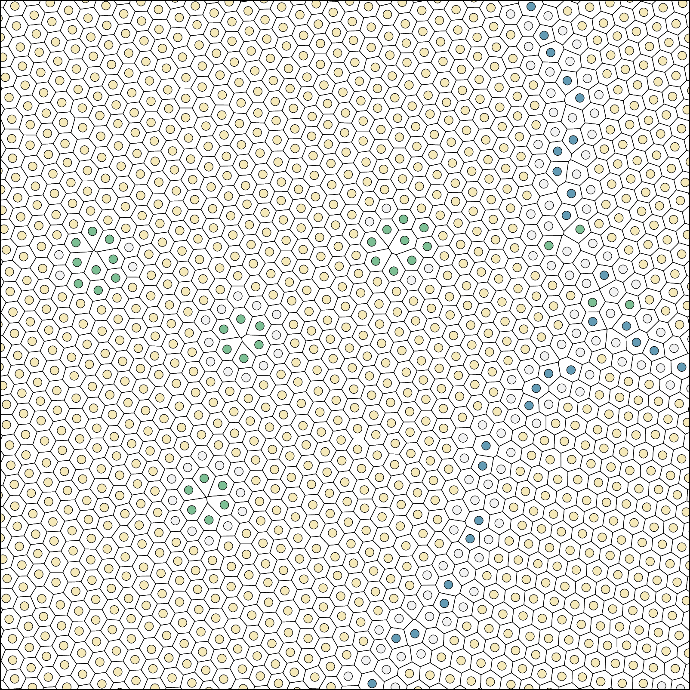
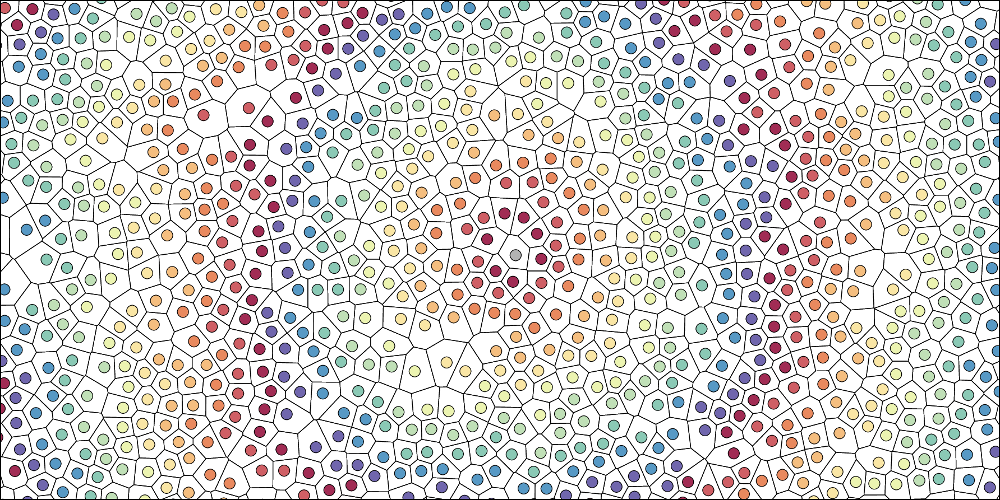
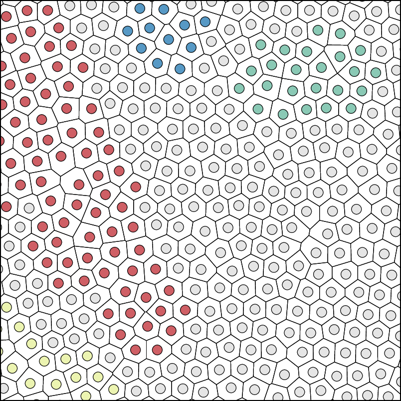
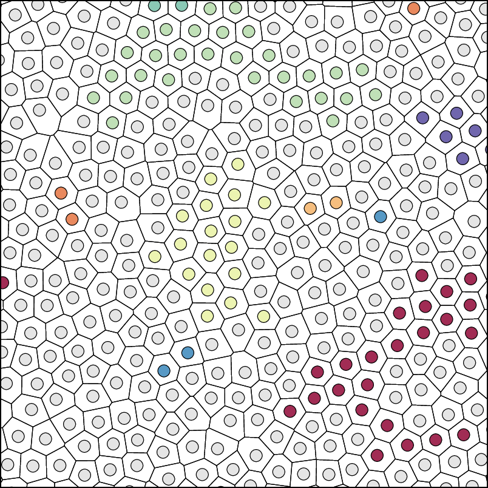
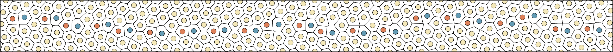

# Example 5: Generate EPS files for visualization

**Learning objectives:**

* After completing this example, you will be able to:
    * Generate high-quality encapsulated PostScript (EPS) vector graphics of two-dimensional particle systems and their Voronoi cells.
    * Use different coloring schemes to highlight structural features such as defects, grain boundaries, and cluster information.
    * Control visualization parameters including particle coloring, cell drawing, and system regions.
    * Create publication-ready figures for scientific presentations and papers.
<br><br>

**Background:**

While numerical analysis provides quantitative insights into particle systems, visual representation is essential for understanding structural features and communicating results. *VoroTop* includes powerful visualization capabilities that generate encapsulated PostScript (EPS) files—a vector graphics format ideal for scientific publications due to its scalability and high quality at any resolution.

The EPS output feature can render both particles and their Voronoi cells with various coloring schemes that highlight different structural aspects. Unlike raster images, EPS files maintain perfect clarity when scaled, making them ideal for journal publications, presentations, and detailed structural analysis. The visualization capabilities are particularly effective for two-dimensional systems where both the overall structure and fine details can be clearly observed.

*VoroTop*'s visualization goes beyond simple particle plotting by integrating structural analysis directly into the visual output. Particles can be colored according to their Voronoi topology, filter classifications, cluster membership, or distance relationships, providing immediate visual insight into the system's structural organization.
<br><br>

**Input data:**

* **Files:** `IdealGas2D`, `Polycrystal2D`, `Liquid2D`, `Melting2D`, `Crystallizing2D`, `GrainBoundary2D`
* **Format:** LAMMPS dump format with particle coordinates
* **Filter files:** `crystal_2d.filter`, `crystal-and-defects_2d.filter`
* **Description:** 
  - `IdealGas2D`: a two-dimensional ideal gas, points randomly distributed
  - `Polycrystal2D`: a two-dimensional polycrystal with grain boundaries and point defects
  - `Liquid2D`: a two-dimensional Lennard-Jones liquid
  - `Melting2D`: a superheated crystal undergoing melting
  - `Crystallizing2D`: a supercooled liquid undergoing crystallization
  - `GrainBoundary2D`: Bicrystal system showing a single grain boundary interface
<br><br>

**Steps:**

1.  **Navigate to the example directory:** Open your terminal or command prompt and navigate to the example directory.

    ```bash
    cd VoroTop/Tutorial/Example05-EPSVisualization
    ```
<br>

2.  **Generate basic visualization with edge coloring:** Create EPS files showing particles colored black or else according to the number of Voronoi cell edges:

    ```bash
    VoroTop IdealGas2D -2 -e 1 -n
    VoroTop IdealGas2D -2 -e 0 
    VoroTop IdealGas2D -2 -e 1 
    VoroTop IdealGas2D -2 -e 2
    ```
  <div style="display: flex; justify-content: space-around; align-items: flex-start; margin: 0 30px;">
    <figure style="margin: 10px;">
      
      <figcaption style="text-align: center; font-style: italic;">Black particles, no cells</figcaption>
    </figure>
    <figure style="margin: 10px;">
      
      <figcaption style="text-align: center; font-style: italic;">Voronoi cells, no particles</figcaption>
    </figure>
    <figure style="margin: 10px;">
      
      <figcaption style="text-align: center; font-style: italic;">Particles and cells</figcaption>
    </figure>
    <figure style="margin: 10px;">
      
      <figcaption style="text-align: center; font-style: italic;">Color according to edges</figcaption>
    </figure>
  </div>
<br>


3.  **Generate structure-based visualization:** Create an EPS file using filter-based structural classification:

    ```bash
    VoroTop Polycrystal2D -2 -c -f crystal_2d.filter -e 3
    VoroTop Polycrystal2D -2 -c -f crystal-and-defects_2d.filter -e 3
    ```

    <div>
    <figure>
      
      <figcaption>Crystal structure in light yellow, all other structures in dark blue</figcaption>
    </figure>
    <figure>
      
      <figcaption>Crystal structure in light yellow, grain boundaries in dark blue, vacancy types in green, and all else in light gray</figcaption>
    </figure>
    </div>
<br>


4.  **Generate distance-based visualization:** Create an EPS file showing Voronoi distance from the system center:

    ```bash
    VoroTop Liquid2D -2 -e 4 
    ```

<figure>
  
  <figcaption>
    A Lennard-Jones liquid; particles colored by their Voronoi distance from a central particle.
  </figcaption>
</figure>
<br>

5.  **Generate cluster-based visualization:** Create an EPS file showing defect clusters:

    ```bash
    VoroTop Melting2D -2 -c -f crystal_2d.filter -e 5
    VoroTop Crystallizing2D -2 -c -f crystal_2d.filter -e 6
    ```
  <div style="display: flex; justify-content: space-around; align-items: flex-start; margin: 0 30px;">
<figure>
  
  <figcaption>
    A crystal in the process of melting; clusters of non-crystalline atoms are colored.
  </figcaption>
</figure>
<figure>
  
  <figcaption>
    A liquid in the process of crystallizing; clusters of crystalline atoms are colored.
  </figcaption>
</figure>
  </div>
<br>

  
<br>

6.  **Visualizing grain boundaries:** Create an EPS file showing only a subset of particles for detailed analysis:

    ```bash
    VoroTop GrainBoundary2D -2 -e 
    ```
<figure>
  
  <figcaption>
    A simple grain boundary in a finite-temperature crystal; particles colored according to number of Voronoi cell edges.
  </figcaption>
</figure>

<br><br>

**Command-line options explained:**

* **-e [coloring_scheme] [particle_count]**: Generate EPS output
  - `coloring_scheme`: Determines *how* particles are colored (see table below)
  - `particle_count` (optional): Number of particles to draw (creates focused view)
* **-n**: Draw only Voronoi cells, but **no** particles
* **-2**: Specify two-dimensional analysis
* **-f**: Load filter file for structure-based coloring
* **-c**: Perform cluster analysis (required for cluster-based coloring schemes)


**Coloring scheme options:**

| Scheme | Description | Requirements |
|--------|-------------|--------------|
| 0 | No particles drawn (cells only) | None |
| 1 | All particles colored black | None |
| 2 | Particles colored by number of Voronoi edges | None |
| 3 | Particles colored by filter classification | Filter file (-f) |
| 4 | Particles colored by Voronoi distance from center | None |
| 5 | Particles colored by defect cluster ID | Filter file (-f) and cluster analysis (-c) |
| 6 | Particles colored by crystal cluster ID | Filter file (-f) and cluster analysis (-c) |
| 7 | Particles colored by defect cluster size | Filter file (-f) and cluster analysis (-c) |
| 8 | Particles colored by crystal cluster size | Filter file (-f) and cluster analysis (-c) |

<br>

----


**File format and usage:**

The generated EPS files are vector graphics that can be:
- **Viewed directly**: Using PostScript viewers or document readers
- **Converted to other formats**: Using tools like epstopdf or ImageMagick
  ```bash
  epstopdf filename.eps
  convert -density 100 filename.eps filename.png
  ```
- **Included in publications**: Direct inclusion in LaTeX documents or other publishing systems
- **Edited further**: Using vector graphics editors like Inkscape or Adobe Illustrator


<br><br>

## References

* Lazar, E.A. "*VoroTop: Voronoi Cell Topology Visualization and Analysis Toolkit*", [arXiv](https://arxiv.org/abs/1804.04221), [Model. Simul. Mater. Sci. Eng. 26:1](https://iopscience.iop.org/article/10.1088/1361-651X/aa9a01), 2017.

* Lazar, E.A., Lu, J., Rycroft, C.H., and Schwarcz, D., "*Characterizing structural features of two-dimensional particle systems through Voronoi topology*", [arXiv](https://arxiv.org/abs/2406.00553), [Model. Simul. Mater. Sci. Eng. 32:085022](https://iopscience.iop.org/article/10.1088/1361-651X/ad8ad9), 2024.

## Acknowledgments
This README was written with assistance from Claude (Anthropic).